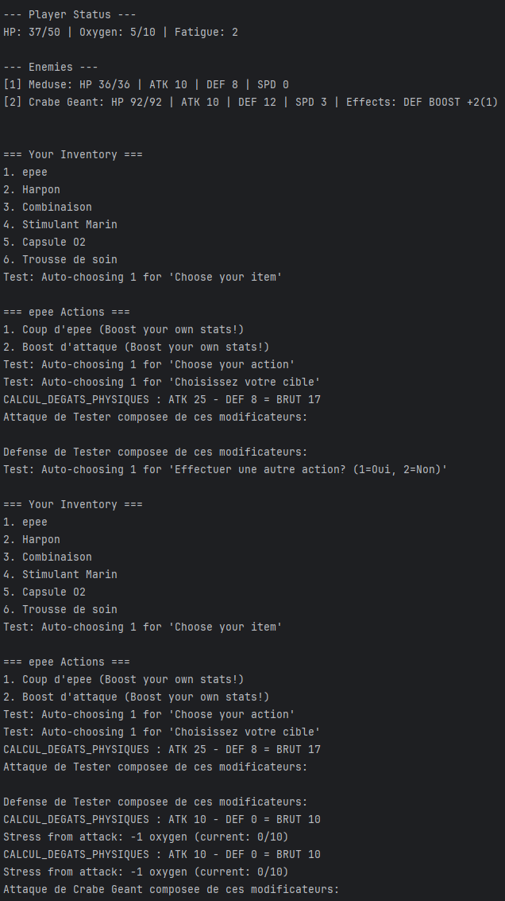
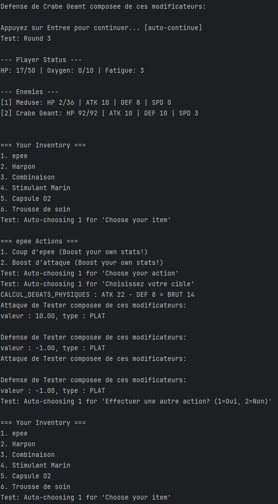
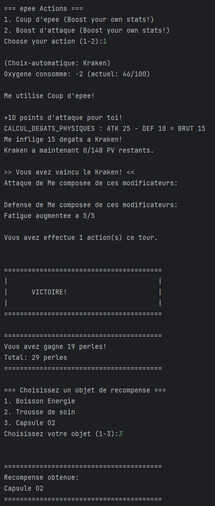
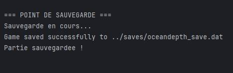
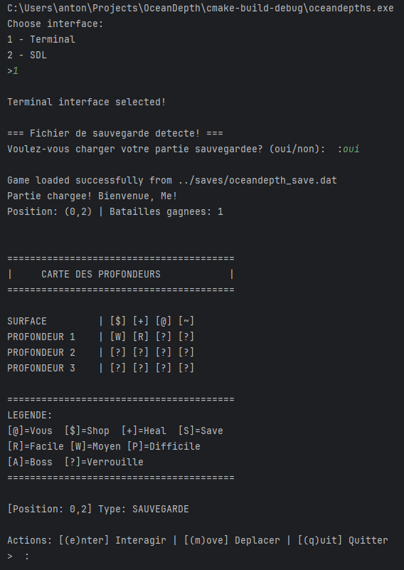
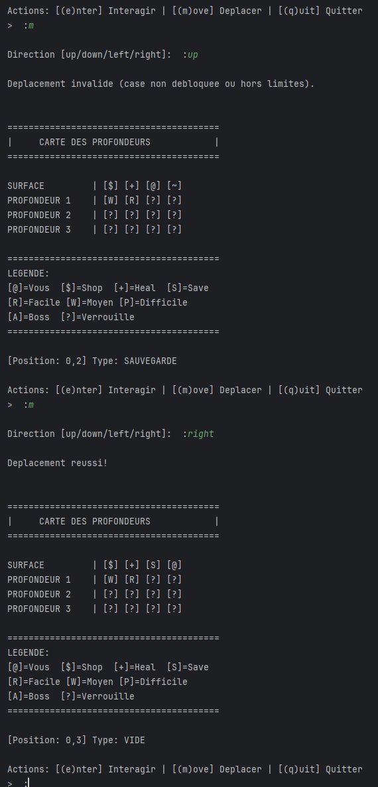
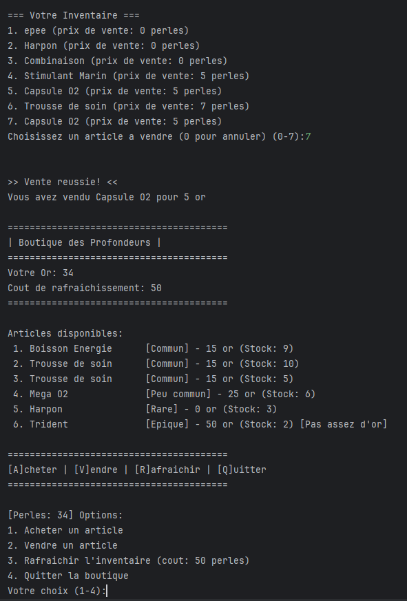
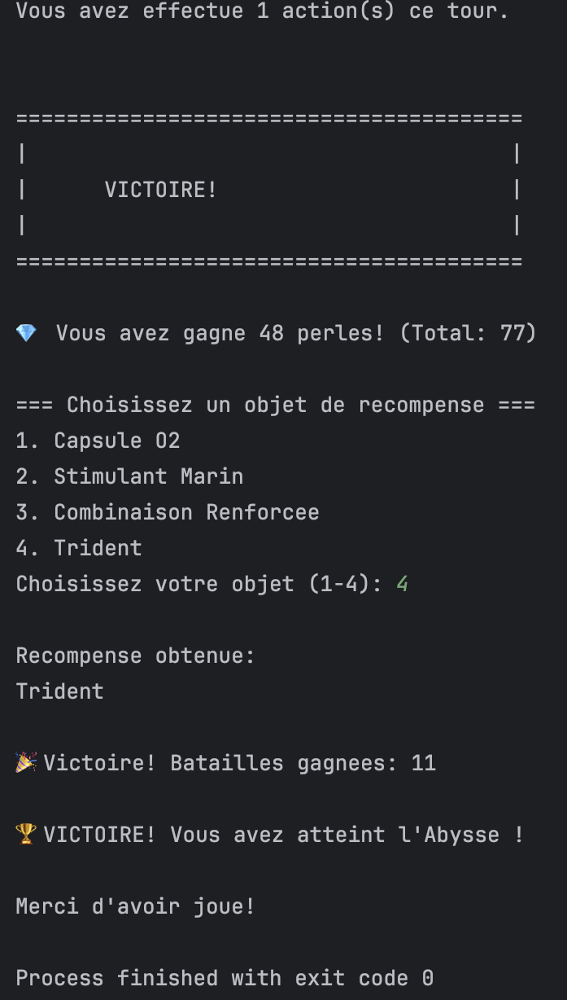

# Progression OceanDepths
## Étapes réalisées
- [x] Étape 1 : Génération créatures
- [x] Étape 2 : Attaque joueur
- [X] Étape 3 : Attaque créatures
- [x] Étape 4 : Récompenses
- [x] Étape 5 : Sauvegarde/Chargement
- [x] Étape 6 : Compétences aquatiques
- [x] Étape 7 : Cartographie des océans
- [x] Bonus : Marchand
- [x] Bonus : Défis spéciaux : Boss
- [x] Bonus : Système de progression (le joueur débloque des parties de la carte, pas de niveaux)

## Captures d'écran :
- 1. Génération des creatures & Attaque des créatures :

---

### 2 & 3. Attaque du joueur : on peut voir la méduse perdre des points de vie après l'attaque du joueur.

---

### 4. Récompenses : 

---

###  5. Sauvegarde/Chargement : Sauvegarde les données en binaire à partir d'un struct et les charge ensuite de la même manière.

---

###  6. Compétences aquatiques (basé sur l'équipement pour le joueur, definit pour les créatures) :

---

### 7. Cartographie des océans :

---

### Bonus : Marchand

### Bonus : Défis spéciaux : Boss

### Bonus : Système de progression (le joueur débloque des parties de la carte, pas de niveaux)

Cette version de la carte est une version antérieure à la version finale, mais elle illustre le système de progression.

La seule différence est la partie visuelle, qui à été changée pour être compatible avec tout terminal qui supporte l'ASCII

## Difficultés rencontrées

- Séparer la logique de l'interface

- L'intégration du code entre les différentes versions de chaque membre du groupe

- Suivre strictement les demandes

- Prévoir les implémentations de manière modulaire
 
- Le projet en lui même

- Les effets (4 versions différentes avant d'arriver à un résultat satisfaisant)

- La mise en place des tests et de s'assurer qu'ils soient pertinents
